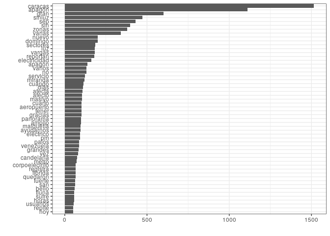

Análisis de un episodio
================
Magdiel Ablan
21 de marzo de 2019

## Introducción

Este documento resume los análisis realizados para el muestreo en
twitter de los eventos relacionados con un episodio de falla de la
energía electrica o apagón. Se asume que los tweets ya fueron recogidos
y están en un archivo .csv que tiene como nombre la fecha en la que se
realizó el muestreo y que debe incluir en el pasado reciente uno de
estos episodios. En este ejemplo se analizan los tweets del muestreo
realizado para el 11 de septiembre del 2018. En el documento habría que
decir: a) Donde y cuando se produjo ese apagón. b) Cuál fue la duración
c) Cuáles fueron las palabras claves y los parámetros usados en el
muestreo o recolección de los datos.

### Preliminares

Hay que cargar todas las librerías necesarias para el análisis. Es
posible que sea necesario depurar esta lista, pero por ahora seguimos
con todas las que hemos usado en algún momento:

``` r
library(tidyverse)                    # Data manipulation
library(stringr)                      # String manipulation
library(knitr)                        # Report generation
library(tidytext)                     # text mining, Silge package
library(stopwords)                    # to clean up text
library(lubridate)                    # to ease date manipulation
library(wordcloud)                    # to make word clouds
library(RColorBrewer)                 # nice colors
library(gridExtra)                    # For graph related to
library(scales)                       
library(readxl)                       # For reading excel files
library(igraph)                       # For making the bigrams graphs
library(ggraph)                       # For making the bigrams graphs
library(reshape2)
```

Aparecen algunas advertencias que en principio pueden ser ignoradas sin
problemas.

Lo segundo es leer el archivo que contiene los datos a analizar. Este
nombre cambirá para los diferentes episodios y debe ser especificado en
el encabezado de este documemto donde dice params. El archivo debe estar
almacenado en el mismo directorio donde esta este documento.

``` r
probe=read_csv(params$data, col_types= cols(
  status_id = col_character(),
  created_at = col_datetime(format = ""),
  user_id = col_character(),
  screen_name = col_character(),
  text = col_character(),
  source = col_character(),
  is_quote = col_logical(),
  is_retweet = col_logical(),
  favorite_count = col_integer(),
  retweet_count = col_integer()))
```

La siguiente instruccion es necesaria para asegurarse de obtener los
caracteres propios del español de manera adecuada:

``` r
probe$text=iconv(probe$text, origen,destino, sub="")
head(probe,3)
```

    ## # A tibble: 3 x 10
    ##   status_id created_at          user_id screen_name text  source is_quote
    ##   <chr>     <dttm>              <chr>   <chr>       <chr> <chr>  <lgl>   
    ## 1 10388250… 2018-09-09 16:22:58 240026… contrapunt… #Sin… Twitt… FALSE   
    ## 2 10391465… 2018-09-10 13:40:10 240026… contrapunt… #Más… Postc… FALSE   
    ## 3 10388276… 2018-09-09 16:33:12 240026… contrapunt… #Sin… Twitt… FALSE   
    ## # … with 3 more variables: is_retweet <lgl>, favorite_count <int>,
    ## #   retweet_count <int>

La siguiente función se hace para limpiar el texto de patrones no
informativos. Esta función fue tomada del documento de Amat y funciona
de forma similar a `unnest_token` de Silge y Robinson:

``` r
limpiar_tokenizar <- function(texto){
  # El orden de la limpieza no es arbitrario
  # Se convierte todo el texto a minúsculas
  nuevo_texto <- tolower(texto)
  # Eliminación de páginas web (palabras que empiezan por "http." seguidas
  # de cualquier cosa que no sea un espacio)
  nuevo_texto <- str_replace_all(nuevo_texto,"http\\S*", "")
  # Eliminación de signos de puntuación
  nuevo_texto <- str_replace_all(nuevo_texto,"[[:punct:]]", " ")
  # Eliminación de números
  nuevo_texto <- str_replace_all(nuevo_texto,"[[:digit:]]", " ")
  # Eliminación de espacios en blanco múltiples
  nuevo_texto <- str_replace_all(nuevo_texto,"[\\s]+", " ")
  # Tokenización por palabras individuales
  nuevo_texto <- str_split(nuevo_texto, " ")[[1]]
  # Eliminación de tokens con una longitud < 2
  nuevo_texto <- keep(.x = nuevo_texto, .p = function(x){str_length(x) > 1})
  return(nuevo_texto)
}
```

y finalmente ejecutamos esta función sobre todos los registros en
`probe` para obtener los datos a analizar:

``` r
tweets <- probe %>% mutate(texto_tokenizado = map(.x = text,
                                                   .f = limpiar_tokenizar))
head(tweets$texto_tokenizado,3)
```

    ## [[1]]
    ##  [1] "sinluz"     "nuevamente" "en"         "varios"     "sectores"  
    ##  [6] "de"         "caracas"    "los"        "apagones"   "en"        
    ## [11] "la"         "capital"    "de"         "venezuela"  "se"        
    ## [16] "han"        "hecho"      "cada"       "vez"        "más"       
    ## [21] "frecuentes" "dónde"      "ud"         "está"       "hay"       
    ## [26] "luz"       
    ## 
    ## [[2]]
    ##  [1] "másleídas" "sinluz"    "repite"    "apagón"    "en"        "caracas"  
    ##  [7] "varios"    "sectores"  "se"        "quedaron"  "otra"      "vez"      
    ## [13] "sin"       "luz"       "el"        "domingo"  
    ## 
    ## [[3]]
    ##  [1] "sinluz"       "cerca"        "de"           "las"          "pm"          
    ##  [6] "de"           "este"         "feb"          "se"           "fue"         
    ## [11] "la"           "luz"          "en"           "la"           "gran"        
    ## [16] "caracas"      "los"          "apagones"     "son"          "cada"        
    ## [21] "vez"          "más"          "recurrentes"  "en"           "la"          
    ## [26] "capital"      "venezolana"   "donde"        "por"          "cierto"      
    ## [31] "hoy"          "hidrocapital" "reportó"      "fallas"       "de"          
    ## [36] "servicio"     "de"           "agua"         "en"           "municipios"  
    ## [41] "feb"

Ahora se seleccionan todas las columna excepto la del texto original del
twwet. La columna de “texto\_tokenizado”" se despliega y se cambia de
nombre a “token”:

``` r
tweets_tidy <- tweets %>% select(-text) %>% unnest()
```

    ## Warning: `cols` is now required.
    ## Please use `cols = c(texto_tokenizado)`

``` r
tweets_tidy <- tweets_tidy %>% rename(token = texto_tokenizado)
head(tweets_tidy[,5:10])
```

    ## # A tibble: 6 x 6
    ##   source             is_quote is_retweet favorite_count retweet_count token     
    ##   <chr>              <lgl>    <lgl>               <int>         <int> <chr>     
    ## 1 Twitter for iPhone FALSE    FALSE                  54           227 sinluz    
    ## 2 Twitter for iPhone FALSE    FALSE                  54           227 nuevamente
    ## 3 Twitter for iPhone FALSE    FALSE                  54           227 en        
    ## 4 Twitter for iPhone FALSE    FALSE                  54           227 varios    
    ## 5 Twitter for iPhone FALSE    FALSE                  54           227 sectores  
    ## 6 Twitter for iPhone FALSE    FALSE                  54           227 de

Listo. Ya tenemos los datos en el formato necesario para analizarlos

### Distribución temporal de los tweets

Lo podemos visualizar como un histograma o como un gráfico de linea,
pero no creo necesario incluir los dos. En este caso, me gusta más el
gráfico de línea.

Esto hay que correlacionarlo con la investigación sobre noticias del
apagon. Algunas consideraciones para el análisis: ¿Los datos de tweeter
registrán el evento? ¿Este registro se produce después o en el momento
mismo del apagón?

``` r
ggplot(tweets, aes(x = as.Date(created_at))) +
  geom_histogram(position = "identity", bins = 20, show.legend = FALSE) +
  scale_x_date(date_labels = "%d-%m-%Y", date_breaks = "day") +
  labs(x = "fecha de publicación", y = "número de tweets") +
  theme(axis.text.x = element_text(angle = 90))
```

<!-- -->

Como gráfico de
línea:

``` r
tweets_day_mes_anyo <- tweets %>% mutate(day_mes_anyo = format(created_at, "%Y-%m-%d"))
tweets_day_mes_anyo %>% group_by(day_mes_anyo) %>% summarise(n = n()) %>%
  ggplot(aes(x = day_mes_anyo, y = n)) +
  geom_line(group=1) +
  labs(title = "Número de tweets publicados", x = "fecha de publicación",
       y = "número de tweets") +
  theme(axis.text.x = element_text(angle = 90, size = 8),
        legend.position = "bottom")
```

<!-- -->

### Palabras más utilizadas

¿Cuáles fueron las 30 palabras más utilizadas en los tweets?:

``` r
tweets_tidy %>% group_by(token) %>% count(token) %>% 
  arrange(desc(n)) %>% print(n=30)
```

    ## # A tibble: 2,650 x 2
    ## # Groups:   token [2,650]
    ##    token            n
    ##    <chr>        <int>
    ##  1 caracas       1515
    ##  2 de            1342
    ##  3 en            1258
    ##  4 apagón        1111
    ##  5 la            1074
    ##  6 gran           599
    ##  7 el             537
    ##  8 sinluz         471
    ##  9 sep            431
    ## 10 sin            398
    ## 11 zonas          379
    ## 12 se             350
    ## 13 varias         340
    ## 14 este           301
    ## 15 un             274
    ## 16 que            272
    ## 17 los            262
    ## 18 del            256
    ## 19 por            254
    ## 20 nuevo          200
    ## 21 domingo        199
    ## 22 sectores       184
    ## 23 luz            182
    ## 24 vargas         181
    ## 25 reportan       179
    ## 26 electricidad   163
    ## 27 apagon         137
    ## 28 hasta          137
    ## 29 no             132
    ## 30 varios         132
    ## # … with 2,620 more rows

Vemos que esto incluye un conjunto de palabras no muy interesantes.
Vamos a excluir del análisis los articulos, preposiciones, etc. del
español (de, en, el, etc.). A este conjunto de palabras normalmente se
les conoce como “stopwords”. Nosotros estamos usando la lista
proporcionada para el español en el paquete stopwords de R
(<https://github.com/quanteda/stopwords>) que a su vez proviene de
snowball (<http://snowballstem.org/projects.html>). Esta lista incluye
las palabras “si”,“no” y “sin” que pueden resultar importantes en el
analisis de sentimientos asi que las excluimos de la lista.

Al nuevo marco de datos, sin estas palabras lo vamos a llamar
tweets\_tidy2:

``` r
# Esto es una lista de palabras a excluir del analisis
lista_stopwords <-stopwords("es")

lista_stopwords.df <-as.data.frame(lista_stopwords,stringsAsFactors = FALSE)
colnames(lista_stopwords.df)<-"token"

# Quitar de la lista de stopwords no, sin, sí
lista_stopwords.df = lista_stopwords.df %>% filter(token != "sí",token != "no",token != "sin")

# palabras sin stopwords
tweets_tidy2 <- tweets_tidy %>% anti_join(lista_stopwords.df)
```

    ## Joining, by = "token"

y de nuevo visualizamos las palabras más comúnes:

``` r
tweets_tidy2 %>% group_by(token) %>% count(token) %>% 
  top_n(10, n) %>% arrange(desc(n)) %>% print(n=30)
```

    ## # A tibble: 2,522 x 2
    ## # Groups:   token [2,522]
    ##    token            n
    ##    <chr>        <int>
    ##  1 caracas       1515
    ##  2 apagón        1111
    ##  3 gran           599
    ##  4 sinluz         471
    ##  5 sep            431
    ##  6 sin            398
    ##  7 zonas          379
    ##  8 varias         340
    ##  9 nuevo          200
    ## 10 domingo        199
    ## 11 sectores       184
    ## 12 luz            182
    ## 13 vargas         181
    ## 14 reportan       179
    ## 15 electricidad   163
    ## 16 apagon         137
    ## 17 no             132
    ## 18 varios         132
    ## 19 servicio       122
    ## 20 miranda        119
    ## 21 cuándo         113
    ## 22 días           111
    ## 23 afecta         109
    ## 24 afectó         106
    ## 25 masivo         104
    ## 26 aeropuerto     103
    ## 27 cuarto         103
    ## 28 tener          102
    ## 29 gracias        101
    ## 30 amplio          99
    ## # … with 2,492 more rows

Algunas de las palabras más utilizadas tienen que ver justamente con los
palabras claves utilizadas para la búsqueda (apagón, luz, etc.). Otras
son descriptores geográficos: (miranda, vargas, etc.) o temporales
(domingo, días, sep.)

Podemos visualizar mejor esto graficamente con un histograma de todas
aquellas palabras que tienen frecuencias superiores a 50:

``` r
tweets_tidy2 %>% group_by(token) %>% count(token) %>%
arrange(desc(n)) %>% filter(n>50) %>% 
  ggplot(aes(x =reorder(token,n) , y = n)) +
  geom_col() +
  theme_bw() +
  labs(y = "", x = "") +
  theme(legend.position = "none") +
  coord_flip() 
```

<!-- -->

La palabra “gran” probablemente viene en conjunción con “gran caracas”.
Las palabras más comunes tienen que ver definitivamente con los terminos
utilizados en la búsqueda y descriptores de lugar y tiempo.

También podemos visualizar la información anterior como una nube de
palabras. En `tidy3` vamos a guardar la lista de palabras con su
frecuencia:

``` r
tidy3 = tweets_tidy2 %>% group_by(token) %>% count(token) %>% 
   arrange(desc(n)) 
wordcloud(words = tidy3$token, freq = tidy3$n,
          max.words = 300, random.order = FALSE, rot.per = 0.35,
          colors = brewer.pal(8, "Dark2"))
```

<!-- -->

### Análisis de Sentimientos

Para realizar el analisis de sentimientos es necesario tener un lexicón
que indica para un idioma o lenguaje, la polaridad de las palabras: si
es positiva, negativa o neutra. Palabras no incluidas en el lexicón se
presumen neutras. En español no pudimos ubicar un lexicón nativo o
propio. En el idioma inglés hay varios. Uno de los cuales ha sido
traducido al español y a otros idiomas y es el que utilizamos aquí. Esto
puede tener ciertas limitantes pero es apropiado para este primer
ejercicio de análisis. Aquí usamos el lexicón: NRC Emotion Lexicon cuya
referencia es:

> Saif Mohammad and Peter Turney. Crowdsourcing a Word-Emotion
> Association Lexicon. Computational Intelligence, 29(3): 436-465, 2013.
> Wiley Blackwell Publishing Ltd.

Primero, leemos y formateamos el lexicón:

``` r
# Leer la base de datos
sentiments <- read_excel("NRC-Emotion-Lexicon-v0.92-spanish.xlsx", 
                         col_types = c("text", "text", "numeric", 
                                       "numeric", "blank", "blank", "blank", 
                                       "blank", "blank", "blank", "blank", 
                                       "blank"))
```

    ## `col_type = "blank"` deprecated. Use "skip" instead.

``` r
# Cambiar los nombres de las columnas 
names(sentiments) <- c("ingles","palabra","Positivo","Negativo")

# Calcular el sentimiento de cada palabra
sentimientos <-sentiments %>% mutate (valor = Positivo + -1*Negativo)
```

Hay varias palabras del inglés que traducen a la misma palabra del
español. Por ejemplo: food, meal y grub todas están traducidas como
comida. Además, ¡food tiene polaridad positiva pero meal y grub tienen
valores neutros\!. Lo que se hizo fue ordenar en order alfabético por
palabras del español y conservar solo el primer registro de cada
palabra:

``` r
# Eliminar palabras repetidas:
sentimientos <- arrange(sentimientos,palabra) %>%
  distinct(palabra,.keep_all = TRUE)

head(sentimientos)
```

    ## # A tibble: 6 x 5
    ##   ingles     palabra       Positivo Negativo valor
    ##   <chr>      <chr>            <dbl>    <dbl> <dbl>
    ## 1 aboard     a bordo              0        0     0
    ## 2 blindly    a ciegas             0        1    -1
    ## 3 checkered  a cuadros            0        0     0
    ## 4 aloof      a distancia          0        1    -1
    ## 5 stealthily a hurtadillas        0        0     0
    ## 6 adrift     a la deriva          0        1    -1

Ahora calculamos el valor o sentimiento neto de cada palabra en el
lexicón:

``` r
sentimientos <-sentiments %>% mutate (valor = Positivo + -1*Negativo)
head(sentimientos)
```

    ## # A tibble: 6 x 5
    ##   ingles      palabra    Positivo Negativo valor
    ##   <chr>       <chr>         <dbl>    <dbl> <dbl>
    ## 1 aback       detrás            0        0     0
    ## 2 abacus      ábaco             0        0     0
    ## 3 abandon     abandonar         0        1    -1
    ## 4 abandoned   abandonado        0        1    -1
    ## 5 abandonment abandono          0        1    -1
    ## 6 abate       disminuir         0        0     0

Y añadimos esta información a la lista de tokens extraidos de nuestros
tweets:

``` r
# Añadir el sentimiento a cada palabra en la lista de tweets
tweets_sent <- inner_join(x = tweets_tidy, y = sentimientos,
                          by = c("token" = "palabra"))
head(head(tweets_sent[,5:14]))
```

    ## # A tibble: 6 x 10
    ##   source is_quote is_retweet favorite_count retweet_count token ingles Positivo
    ##   <chr>  <lgl>    <lgl>               <int>         <int> <chr> <chr>     <dbl>
    ## 1 Twitt… FALSE    FALSE                  54           227 capi… capit…        0
    ## 2 Twitt… FALSE    FALSE                  54           227 hecho fact          0
    ## 3 Twitt… FALSE    FALSE                  15            67 cerca close         0
    ## 4 Twitt… FALSE    FALSE                  15            67 cerca fence         0
    ## 5 Twitt… FALSE    FALSE                  15            67 cerca nigh          0
    ## 6 Twitt… FALSE    FALSE                  15            67 capi… capit…        0
    ## # … with 2 more variables: Negativo <dbl>, valor <dbl>

Ahora, calculamos el sentimiento promedio de cada tweet:

``` r
ts1=tweets_sent %>% 
  group_by(status_id) %>% 
  summarise(sentimiento_promedio = sum(valor))
head(ts1)
```

    ## # A tibble: 6 x 2
    ##   status_id           sentimiento_promedio
    ##   <chr>                              <dbl>
    ## 1 1036207164862423040                    0
    ## 2 1036224790825193472                    1
    ## 3 1036233458572582914                    1
    ## 4 1036236410972528640                    0
    ## 5 1036238776866095104                    1
    ## 6 1036255562999242758                    0

Luego podemos calcular el porcentaje de tweets positivos, negativos y
neutros en el registro:

``` r
# Calcula el porcentaje de positivos, negativos y neutros d
ts2=tweets_sent %>% group_by(status_id) %>%
  summarise(sentimiento_promedio = sum(valor)) %>%
  summarise(positivos = 100 * sum(sentimiento_promedio > 0) / n(),
            neutros = 100 * sum(sentimiento_promedio == 0) / n(),
            negativos = 100 * sum(sentimiento_promedio < 0) / n())

ts2
```

    ## # A tibble: 1 x 3
    ##   positivos neutros negativos
    ##       <dbl>   <dbl>     <dbl>
    ## 1      27.4    50.6      22.1

y graficamente:

``` r
  ts2%>%
  gather(key = "sentimiento", value = "valor") %>%
  ggplot(aes(x =sentimiento, y = valor, fill = sentimiento)) + guides(fill=FALSE) +
  geom_col(position = "dodge", color = "black") + coord_flip() +
  theme_bw()
```

<!-- -->

La cantidad de tweets positivos y negativos es muy similar.

#### Palabras positivas y negativas más comúnes

Contamos el número de veces que aparece cada palabra y ordenamos por su
frecuencia.

``` r
 sent_count = tweets_sent %>% count(token, valor, sort = TRUE) %>%
    ungroup()
head(sent_count)
```

    ## # A tibble: 6 x 3
    ##   token        valor     n
    ##   <chr>        <dbl> <int>
    ## 1 panorama         0   198
    ## 2 fuerte           0   189
    ## 3 electricidad     1   163
    ## 4 masivo           0   104
    ## 5 aeropuerto       0   103
    ## 6 cuarto           0   103

Podemos visualizar esto como un histograma:

``` r
sent_count %>%
    filter(valor !=0) %>%
    mutate(valor=ifelse(valor== -1,"negativo", "positivo")) %>%
    group_by(valor) %>%
    top_n(10) %>%
    ungroup() %>%
    mutate(token = reorder(token, n)) %>%
    ggplot(aes(token, n, fill = valor)) +
    geom_col(show.legend = FALSE) +
    facet_wrap(~valor, scales = "free_y") +
    labs(y = "Contribución al sentimiento",
         x = NULL) +
    coord_flip()  
```

    ## Selecting by n

<!-- -->

Aquí vemos algunos problemas con la clasificación. Por ejemplo, maduro
está clasificada como una palabra positiva pero seguro hace alusión al
apellido del presidente y por lo tanto debería ser considerada neutra.
Electricidad y eléctrico están clasificadas como positivas, pero en
realidad podrían no serlo dependiendo de la palabra que le antecede o el
contexto. Por ejemplo, si la palabra que antecede a electricidad es
“sin” el termino es negativo y no positivo.

Otro problema con el análisis de sentimiento como lo estamos llevando a
cabo es que algunas de las palabras más comunes reportadas en la sección
anterior no aparecen aquí porque no estaban incluidas en el lexicón. Por
ejemplo, apagón que es ciertamente una palabra negativa no está incluida
en el lexicón.

También podemos visualizar esta información en forma de nubes de
palabras:

``` r
sent_count %>%
   filter(valor !=0) %>%
   mutate(valor=ifelse(valor== -1,"negativo", "positivo")) %>%
   acast(token ~ valor, value.var = "n", fill = 0) %>%
   comparison.cloud(colors = c("gray20", "gray80"),
                    max.words = 100) 
```

<!-- -->

#### Evolución temporal

``` r
tweets_sent %>% mutate(anyo = year(created_at),
                       mes = month(created_at),
                       dia = day(created_at),
                       anyo_mes_dia = ymd(paste(anyo, mes, dia, sep="-"),truncated=2)) %>%
  group_by(anyo_mes_dia) %>%
  summarise(sentimiento = mean(valor)) %>%
  ungroup() %>%
  ggplot(aes(x = anyo_mes_dia, y = sentimiento, color = sentimiento)) +
  geom_point() +
  geom_smooth() +
  labs(x = "fecha de publicación") +
  theme_bw() +
  theme(legend.position = "none")
```

    ## `geom_smooth()` using method = 'loess' and formula 'y ~ x'

<!-- -->

A pesar de los problemas planteados en este análisis la gráfica temporal
pareciera capturar un poco el ánimo de los tweets cuando ocurre la falla
en el servicio eléctrico.

### Relación entre las palabras: bigramas

Mirar a las palabras es solo una primera aproximación a la complejidad
del lenguaje. Un poco mejor es mirar a conjuntos dos palabras o bigramas
que es lo que hacemos en esta sección.

Al igual que antes, debemos limpiar el texto y para eso vamos a usar una
función `limpiar`. Esta vez en vez de seleccionar palabras individuales
seleccionamos conjuntos de dos palabras contiguas y para eso utilizamos
la función `unnest_token`:

``` r
# Función para limpiar el texto:
limpiar <- function(texto){
  # El orden de la limpieza no es arbitrario
  # Se convierte todo el texto a minúsculas
  nuevo_texto <- tolower(texto)
  # Eliminación de páginas web (palabras que empiezan por "http." seguidas
  # de cualquier cosa que no sea un espacio)
  nuevo_texto <- str_replace_all(nuevo_texto,"http\\S*", "")
  # Eliminación de signos de puntuación
  nuevo_texto <- str_replace_all(nuevo_texto,"[[:punct:]]", " ")
  # Eliminación de números
  nuevo_texto <- str_replace_all(nuevo_texto,"[[:digit:]]", " ")
  # Eliminación de espacios en blanco múltiples
  nuevo_texto <- str_replace_all(nuevo_texto,"[\\s]+", " ")
  return(nuevo_texto)
}
```

Ahora si, seleccionamos los bigramas:

``` r
bigramas <- tweets %>% mutate(text = limpiar(text)) %>%
  select(text) %>%
  unnest_tokens(input = text, output = "bigrama",
                token = "ngrams",n = 2, drop = TRUE)
head(bigramas)
```

    ## # A tibble: 6 x 1
    ##   bigrama          
    ##   <chr>            
    ## 1 sinluz nuevamente
    ## 2 nuevamente en    
    ## 3 en varios        
    ## 4 varios sectores  
    ## 5 sectores de      
    ## 6 de caracas

Al igual que con las palabras individuales podemos contar el número de
veces que aparece cada bigrama y omitir los bigramas conformados por
palabras no interesantes que se encuentran en la lista de “stopwords”.

``` r
bigramas %>% count(bigrama, sort = TRUE)
```

    ## # A tibble: 8,111 x 2
    ##    bigrama          n
    ##    <chr>        <int>
    ##  1 gran caracas   548
    ##  2 la gran        509
    ##  3 apagón en      504
    ##  4 de la          351
    ##  5 zonas de       351
    ##  6 en caracas     338
    ##  7 de caracas     333
    ##  8 varias zonas   314
    ##  9 en la          257
    ## 10 nuevo apagón   181
    ## # … with 8,101 more rows

Para poder quitar las palabras no interesantes, debemos primero separar
los bigramas, quitar las palabras y luego rehacer los bigramas de
nuevo:

``` r
bigrams_separados <- bigramas %>% separate(bigrama, c("palabra1", "palabra2"),
                                           sep = " ")
head(bigrams_separados)
```

    ## # A tibble: 6 x 2
    ##   palabra1   palabra2  
    ##   <chr>      <chr>     
    ## 1 sinluz     nuevamente
    ## 2 nuevamente en        
    ## 3 en         varios    
    ## 4 varios     sectores  
    ## 5 sectores   de        
    ## 6 de         caracas

Ahora quitamos los que contienen una palabra no interesante:

``` r
bigrams_separados <- bigrams_separados %>%
  filter(!palabra1 %in% lista_stopwords.df$token) %>%
  filter(!palabra2 %in% lista_stopwords.df$token)
head(bigrams_separados)
```

    ## # A tibble: 6 x 2
    ##   palabra1   palabra2  
    ##   <chr>      <chr>     
    ## 1 sinluz     nuevamente
    ## 2 varios     sectores  
    ## 3 hecho      cada      
    ## 4 cada       vez       
    ## 5 frecuentes dónde     
    ## 6 dónde      ud

Los unimos de nuevo y volvemos a contar la frecuencia de su ocurrencia:

``` r
bigramas <- bigrams_separados %>%
  unite(bigrama, palabra1, palabra2, sep = " ")
# Nuevo contaje para identificar los bigramas más frecuentes
bigramas %>% count(bigrama, sort = TRUE) %>% print(n = 20)
```

    ## # A tibble: 3,560 x 2
    ##    bigrama                n
    ##    <chr>              <int>
    ##  1 gran caracas         548
    ##  2 varias zonas         314
    ##  3 nuevo apagón         181
    ##  4 sin luz              132
    ##  5 sin electricidad     126
    ##  6 reportan apagón      123
    ##  7 varios sectores      119
    ##  8 apagón masivo        104
    ##  9 cuarto apagón        103
    ## 10 sinluz gracias        97
    ## 11 amplio panorama       96
    ## 12 palos grandes         84
    ## 13 sep sinluz            83
    ## 14 servicio eléctrico    83
    ## 15 caracas sinluz        77
    ## 16 apagón afectó         76
    ## 17 afecta varias         74
    ## 18 apagón afecta         72
    ## 19 afectó varias         70
    ## 20 sin servicio          66
    ## # … with 3,540 more rows

Podemos visualizar esto graficamente así. Las dos versiones son
equivalentes pero me gusta más la segunda. Solo habría que incluir una

``` r
graph <- bigramas %>%
  separate(bigrama, c("palabra1", "palabra2"), sep = " ") %>%
  count(palabra1, palabra2, sort = TRUE) %>%
  filter(n >18) %>% graph_from_data_frame(directed = FALSE)
set.seed(123)
plot(graph, vertex.label.font = 2,
     vertex.label.color = "black",
     vertex.label.cex = 0.7, edge.color = "gray85")
```

<!-- -->

``` r
ggraph(graph = graph) +
  geom_edge_link(colour = "gray70") +
  geom_node_text(aes(label = name), size = 4) +
  theme_bw()
```

    ## Using `stress` as default layout

<!-- -->

Son aun más claros los descriptores de sectores geográficos y las
combinaciones usuales de sujeto + adjetivo comunes para hablar de los
eventos que nos ocupan, incluso no incluidos en los términos de búsqueda
(ejemplo: “falla electríca”). En algunos casos se puede entrever la
temática de los mensajes en el grafo conectado.

Es importante tener en cuenta este análisis para interpretar
correctamente el análisis de sentimientos que hacemos a continuación.

#### Revisando el análisis de sentimientos usando bigramas

El uso de una negación antes de una palabra dada puede cambiar
completamente la polaridad del texto. Solo como ejemplo, veamos cuantas
veces la palabra *no* es la primera palabra de una bigrama:

``` r
no_palabras =bigrams_separados %>%
  filter(palabra1 == "no") %>%
  count(palabra1, palabra2, sort = TRUE)
no_palabras
```

    ## # A tibble: 29 x 3
    ##    palabra1 palabra2     n
    ##    <chr>    <chr>    <int>
    ##  1 no       llueve      10
    ##  2 no       trabaja      9
    ##  3 no       solo         6
    ##  4 no       quiere       5
    ##  5 no       hace         4
    ##  6 no       sirve        3
    ##  7 no       aguanta      2
    ##  8 no       pueden       2
    ##  9 no       salimos      2
    ## 10 no       colocan      1
    ## # … with 19 more rows

Ahora, unimos la valoración del sentimiento. Si una palabra tiene
polaridad positiva pero es precedida por no, su polaridad se invierte y
viceversa.

``` r
no_palabras2 <- bigrams_separados %>%
  filter(palabra1 == "no") %>%
  inner_join(sentimientos, by = c("palabra2" = "palabra")) %>%
  count(palabra2, valor, sort = TRUE) %>%
  ungroup()
no_palabras2
```

    ## # A tibble: 3 x 3
    ##   palabra2 valor     n
    ##   <chr>    <dbl> <int>
    ## 1 solo         0     6
    ## 2 hace         0     4
    ## 3 preso       -1     1

Solo estas tres palabras aparecen en el lexicón de sentimientos. Además,
solo y hace son palabras neutras. La polaridad de preso si cambiaría al
estar precedida de la palabra *no*.

Existen otras formas de negación en el español. Repertiremos el análisis
anterior usando, además de *no*: *sin, nunca, jamás, tampoco*.
Anexaremos la valoración pero excluiremos las palabras con valoración 0
o neutras:

``` r
negacion_palabras <- c("no", "nunca", "sin","jamas","tampoco")
negadas_palabras <- bigrams_separados %>%
  filter(palabra1 %in% negacion_palabras) %>%
  inner_join(sentimientos, by = c("palabra2" = "palabra")) %>%
  count(palabra1, palabra2, valor, sort = TRUE) %>%
  ungroup() %>%
  filter(valor != 0)
negadas_palabras
```

    ## # A tibble: 7 x 4
    ##   palabra1 palabra2     valor     n
    ##   <chr>    <chr>        <dbl> <int>
    ## 1 sin      electricidad     1   126
    ## 2 sin      comida           1     5
    ## 3 sin      dinero           1     2
    ## 4 no       preso           -1     1
    ## 5 sin      democracia       1     1
    ## 6 sin      duda            -1     1
    ## 7 sin      recursos         1     1

Electricidad, que tiene asociada una polaridad positiva al estar
precedida por la palabra sin cambia su polaridad a negativa. Este
bigrama ocurre 126 veces en la colección de tweets por lo que el peso de
esta valoración puede cambiar sustancialmente los resultados.

Podemos examinar esto graficamente de la siguiente manera:

``` r
negadas_palabras %>%
  mutate(contribucion = n * valor) %>%
  arrange(desc(abs(contribucion))) %>%
  head(20) %>%
  mutate(palabra2 = reorder(palabra2, contribucion)) %>%
  ggplot(aes(palabra2, n * valor, fill = n * valor > 0)) +
  geom_col(show.legend = FALSE) +
  xlab("Palabras precedidas por una negación") +
  ylab("Valor del sentimiento x número de ocurrencias") +
  coord_flip()
```

<!-- -->

## Pendientes

  - Hacer el análisis de sentimientos para los bigramas
  - Calcular la correlación entre palabras
  - Usar param para el nombre de los datos a analizar
  - Usar la notacion :: para saber que función viene de que paquete
